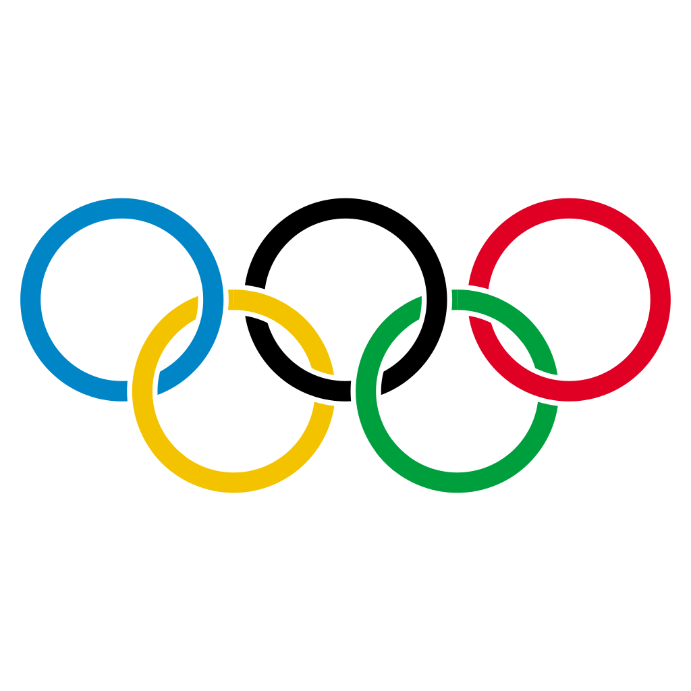

<h1 align="center">Olympics Dataset and Visualization</h1>

##  Objective

With the advent of the data mining operations and computer efficiency to crawl and collect data, enormous data is produced. But is all data that is retrieved relevant ? In this kernel, our goal is to shed light on major patterns in Olympic history. How many athletes, sports, and nations are there? Where do most athletes come from? Which country wins the most medals? Which age group bags the most medals? What percentage of women win medals? What is the ratio of male over female in different years over summer and winter olympics ? 
This project is aimed at analysing Summer / Winter Olympics data. While a dataset was readily available for the initial 120 years of Olympics on Kaggle, no data was provided collectively for the 2020 Tokyo Olympics. So for that particular reason, We have created a dataset to incorporate all year ranges. Future works include making a visualization dashboard and understanding data trends to a deeper level.

## :bulb: Implementation
As mentioned above, The dataset was derived from and worked upon various different datasets. I have combined a couple of datasets to make this combined dataset for people to perform visualization, prediction and others.

<h3><a href="https://www.kaggle.com/datasets/fearsomejockey/olympics-dataset-2020-tokyo-dataset"> Dataset Link </h3></a>
 

The Following dashboard has been created with the help of the python dashboard library “Dash”. Dash apps give a point-&-click interface to models written in Python, vastly expanding the notion of what's possible in a traditional “dashboard.”. Dash apps consist of a Flask server that communicates with front-end React components using JSON packets over HTTP requests.

### :keyboard: &nbsp; Tech Stack

<ul dir="auto">
<li> Python</li>
<li> Flask</li>
<li> R Programming</li>
<li> Plotly</li>
</ul>

